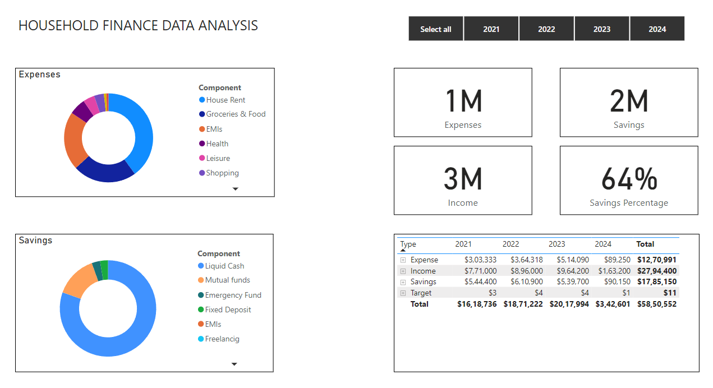
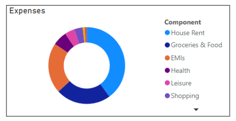
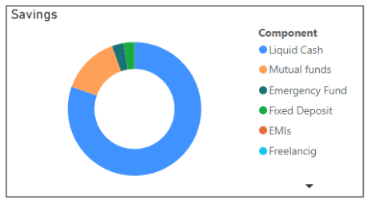
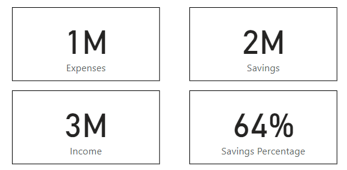
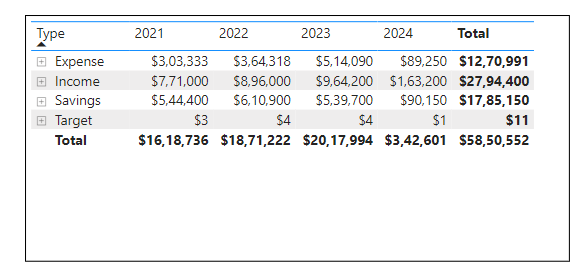
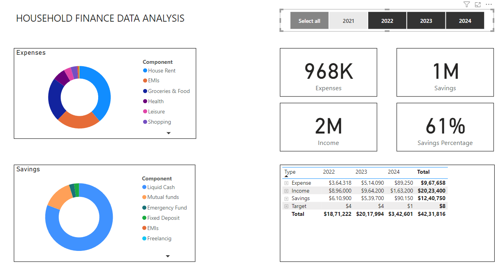
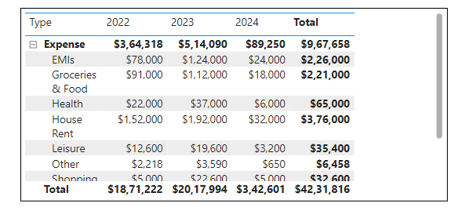

# Household Finance Data Analysis

## Introduction

Welcome to the Household Finance Data Analysis project! This dashboard was created to provide insightful visualizations and analysis on a household finance dataset, including monthly income and expenditure details from 2021 to 2024 of a person. Whether you’re a data analyst, business stakeholder, or just curious about household data analysis, this dashboard is designed to offer clear, actionable insights at a glance.

## Getting Started

### Purpose of the Dashboard
The main objective of this dashboard is to identify the key financial metrics of household finance for a salaried person. By visualizing the data in an intuitive way, the dashboard helps users identify income, expenditure, and savings.

### Key Features
- **Interactive Visualizations:** Explore the data with user-friendly pie charts, card visualizations, and tables that allow you to drill down into the details.
- **Custom Filters:** Tailor the data view according to a specific year to identify the metrics related to that year.

## Navigating the Dashboard

### Overview of Sections
The dashboard is divided into several key sections:

1. **Expenses Pie Chart:** This section provides an overview of the breakdown of various expenses such as House Rent, Groceries and Food, EMI, Health, and more.

   
3. **Savings Pie Chart:** Here, you’ll find detailed visualizations of the breakdown of savings from various categories such as Liquid Cash, Mutual Funds, Emergency Fund, and more.

   
5. **Various Cards:** This area summarizes the overall key financial metrics for household finance data.

    
7. **Table:** This area provides detailed information about key financial metrics such as Income, Expenses, Savings, and Targets with annual data.

   

### How to Use the Dashboard
- **Filters:** Use the filters located on the top right corner of the dashboard to narrow down the data to a specific year.

  
- **Drill-Down Capabilities:** Click on the data points of the table data by choosing the row of the “type” column to explore the underlying data in more detail.

   
## Data Sources
The data in this dashboard is sourced from Excel spreadsheets.

## Conclusion

### Benefits of the Dashboard
By using the Household Finance Data Analysis Dashboard, you will gain:
- A quick understanding of key trends and patterns in household finance data.
- Insights to identify key spend metrics and reduce expenses.
