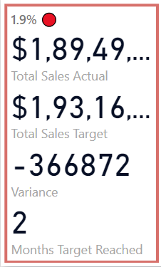

# Finance KPI Report

## Introduction

Welcome to the Finance KPI Report project! This dashboard was created to provide insightful visualizations and analysis of the actual vs. sales data of a team. It offers key insights into the sales performance of a company.

## Getting Started

### Purpose of the Dashboard
The main objective of this dashboard is to analyze the sales performance of a team. By visualizing the data intuitively, the dashboard helps users identify key sales metrics.

### Key Features
- **Interactive Visualizations:** Explore the data with a variety of interactive charts, graphs, and tables that allow you to comprehend trends in the sales data.
- **Custom Filters:** Tailor the data view according to specific needs, such as specific teams.

## Navigating the Dashboard

### Overview of Sections
The dashboard is divided into several key sections:

1. **Sales Target Card:** Provides an overview of sales target metrics and includes key data such as total sales actual, total sales target, variance, and how many months the target has been met by the team.

    
3. **Target Status Visual:** Displays detailed visualizations of monthly target status in the form of a chart (green indicates target achieved, and red indicates target not achieved).

    
5. **Column Chart:** Highlights the comparison of monthly sales targets and actual sales in the form of a column chart. It also displays the percentage difference between the actual sales and the target.

    
7. **Table:** Helps in understanding key metrics such as actual sales, sales target, variance, trend analysis sparkline, and monthly target achievement status specific to a team member.

    
9. **Insights Box:** An auto-generated insights box provides key insights into the sales data overview, offering a narrative that makes it easy to grasp the overall data.

    

### How to Use the Dashboard
- **Filters:** Use the filters located in the bottom right corner to narrow down the data specific to a team.

  
## Data Sources
The data in this dashboard is sourced from Excel files. The data is attributed to the following source: [Chandoo.org](https://chandoo.org).

## Conclusion

### Benefits of the Dashboard
By using the Finance KPI dashboard, you will gain:
- Rapid comprehension of crucial trends and patterns in your sales data.
- Insights into the monthly trend of sales.
- Assessment of individual team member performance and the sales metrics associated with that member.
