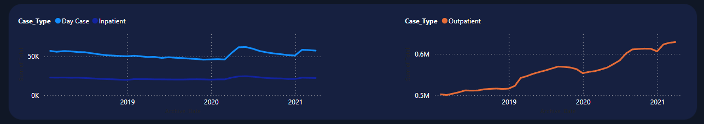

# **Healthcare Data Analysis Dashboard**

## **Introduction**

Welcome to the Healthcare Data Analysis Dashboard project! This dashboard was created to provide insightful visualizations and analyses of patient waitlist data within the healthcare sector. Whether you’re involved in healthcare administration, patient management, or data analysis, this tool offers valuable insights to help you understand key trends and metrics in patient waitlists.

## **Getting Started**

### **Purpose of the Dashboard**

The main objective of this dashboard is to identify key trends in patient data, particularly waitlist metrics. By visualizing the data in an intuitive way, the dashboard helps users explore and understand patterns in healthcare data, aiding in better decision-making and patient management.

### **Key Features**

- **Interactive Visualizations**: Explore the data with a variety of interactive charts, graphs, and tables that allow you to drill down into the details.
- **Custom Filters**: Tailor the data view according to specific needs, such as time periods, categories, or specialties.

## **Navigating the Dashboard**

### **Overview**

The dashboard is divided into two pages, each containing several key sections to provide a comprehensive view of the patient waitlist data.

### **Summary Page**
  
1. **Waitlist Card**: Provides a comparison between the latest month’s waitlist totals and the corresponding totals from the previous year.

    
2. **Case Type Distribution**: Visualizes the distribution of the average or median waitlist by case type, offering insights into different types of patient cases.

    
3. **Waitlist by Age Distribution**: Highlights the distribution of patient waitlists by age profile, presented in a column chart.

    
4. **Top 5 Specialties Card**: Details the top 5 specialties of doctor types, giving insights into which specialties have the highest patient waitlists.

    
5. **Case Type Trend Analysis**: Provides historical trend analysis by case type, such as day cases vs. inpatient and outpatient cases.

    
### **How to Use the Dashboard (Summary Page)**

- **Filters**: Use the filters located at the top right of the dashboard to narrow down the data. Filters include specialty name, case type (inpatient or outpatient), archive date (adjustable with a slider), and a choice between average or median data.

    
- **Drill-Down Capabilities**: Click on any data point in the Case Type Trend Analysis chart to view the data distribution by specialty type.

    

### **Details Page**

  
6. **Detailed Grid View**: Offers an in-depth view of cases in the healthcare industry, organized by archive date. This section helps to understand the daily distribution of cases.

  

### **How to Use the Dashboard (Details Page)**

- **Filters**: Use the filters on the left side of the dashboard to refine the data. Filters include specialty name, case type (inpatient or outpatient), archive date (adjustable with a slider), and time bands filter.

    
- **Drill-Down Capabilities**: Click on any data point in the archive date section within the table to get data specific to the selected time bands.

## **Data Sources**

The data used in this dashboard is sourced from Excel files, with attribution to [Pivotal Stats](https://www.pivotalstats.com/resources).

## **Conclusion**

### **Benefits of the Dashboard**

By using the Healthcare Data Analysis Dashboard, you will gain:

- **Tracking Patient Waitlists**: Monitor the status of patient waitlists efficiently.
- **Trend Analysis**: Analyze historical monthly trends in inpatient and outpatient waitlists.
- **Specialty and Age Profile Analysis**: Obtain detailed insights at the specialty level and age profile of patients.

This dashboard serves as a powerful tool for healthcare professionals and administrators looking to improve patient management and optimize resource allocation.
