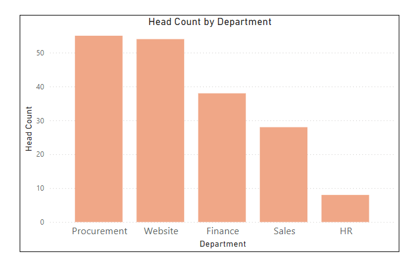
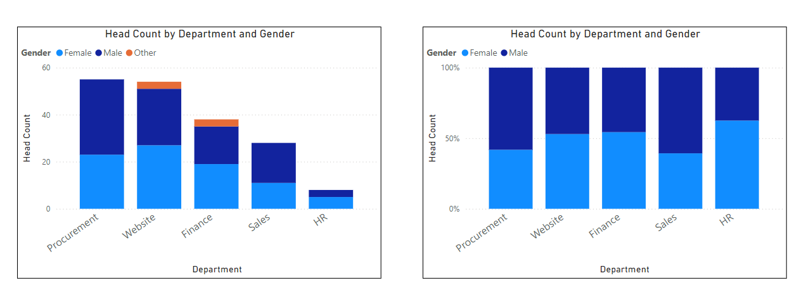
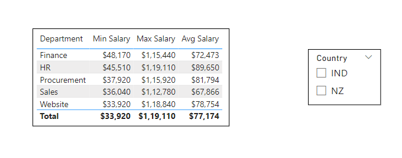
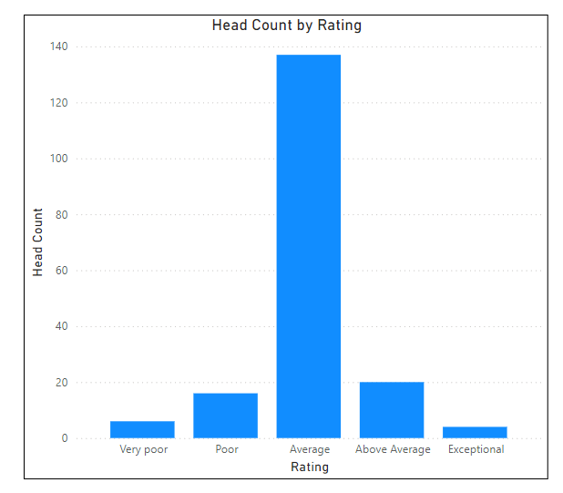
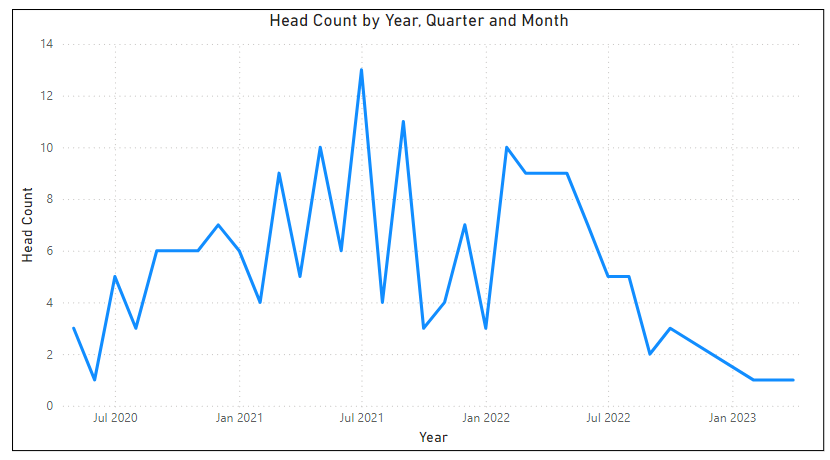
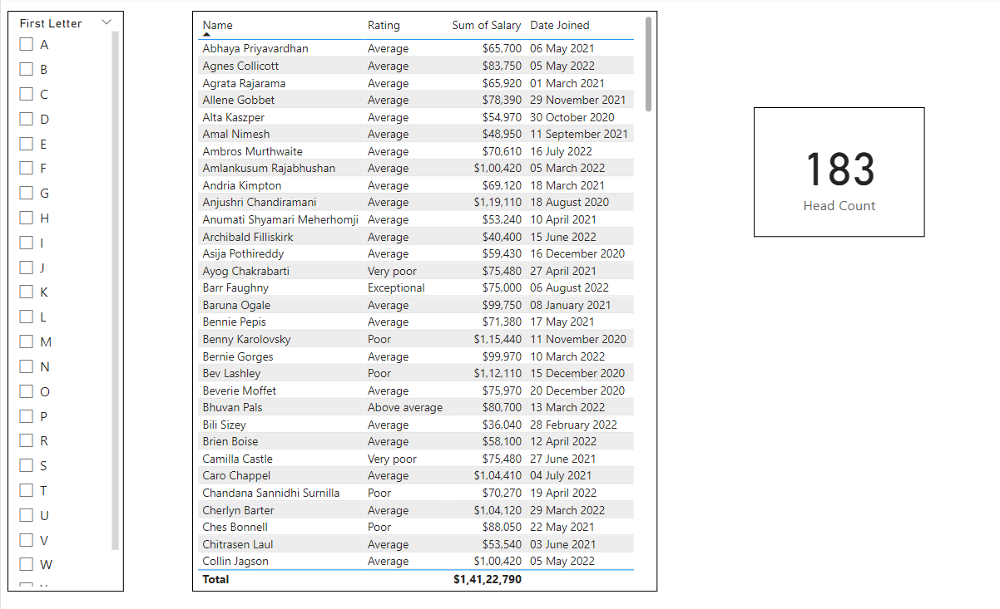
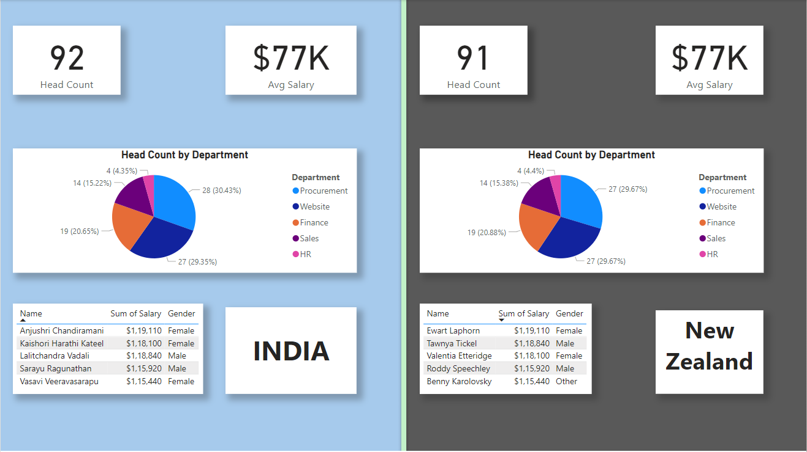

# **Human Resources Data Analysis**

## **Introduction**

Welcome to the Human Resources Data Analysis project! This dashboard was designed to provide comprehensive visualizations and analyses of employee data within the company. Whether you’re a member of the HR team, a manager, or an executive, this tool offers valuable insights to help you understand key human resources metrics and trends.

## **Getting Started**

### **Purpose of the Dashboard**

The primary goal of this dashboard is to offer a clear view of essential human resources metrics, enabling users to explore and understand employee data, trends, and performance across the organization. The intuitive visualizations help in making data-driven decisions by presenting the information in an easily digestible format.

### **Key Features**

- **Interactive Visualizations**: Dive into the data with a range of interactive charts, graphs, and tables, allowing for detailed exploration and analysis.
- **Customized Visualizations**: Each visualization is tailored to answer critical questions about employee data, helping users to focus on what matters most.

## **Navigating the Dashboard**

### **Overview of Sections**

The dashboard is organized into the following key sections:

1. **Head Count**: Provides an overview and trends of headcount by department, displayed in a column chart.

    
3. **Gender Distribution**: Displays headcount by department and gender, offering insights into gender distribution within each department.

    
5. **Age Distribution**: Highlights the age distribution of employees using two column charts—one showing the overall distribution and another displaying age buckets or bins.

     
7. **Salary Distribution**: Presents minimum, maximum, and average salaries across departments, with a filter to view data specific to a particular country.

     
9. **Top Earners**: Lists the top 5 earners in each country, shown in tabular form.

      
11. **Performance Spread**: Illustrates the trend of performance ratings by headcount using a column chart.

     
13. **Company Growth Trend**: Analyzes the monthly trend in headcount, providing insights into the company’s growth over time.

      
15. **Employee Filter by Letter**: Offers details of employees, including rating, salary, and date of joining, with the option to filter by the first letter of their names.

      
17. **Performance vs Salary**: Allows for the analysis of the distribution between employee salaries and performance ratings.

     
19. **India Vs New Zealand Comparison**: Compares overall employee data based on country of origin, specifically between India and New Zealand, including key comparisons like top earners, average salary, headcount, and departmental distribution.

     

### **How to Use the Dashboard**

- **Filters**: Utilize the filters available in specific sections to refine the data according to your needs. These filters enhance the ability to focus on subsets of data, making the analysis more relevant.

## **Data Sources**

The data utilized in this dashboard is sourced from Excel files, with attribution to Chandoo.org.

## **Conclusion**

### **Benefits of the Dashboard**

By using the Human Resources Data Analysis dashboard, you will gain:

- **Key Insights and Trends**: Understand vital employee data and trends within the organization.
- **Performance Analysis**: Track and analyse the performance of individual employees over time.
- **Country-Based Comparisons**: Explore employee distribution and performance based on country of origin, facilitating better decision-making in global HR strategies.

This dashboard is an essential tool for anyone looking to gain a deeper understanding of the company’s human resources dynamics and make informed decisions that drive growth and efficiency.
